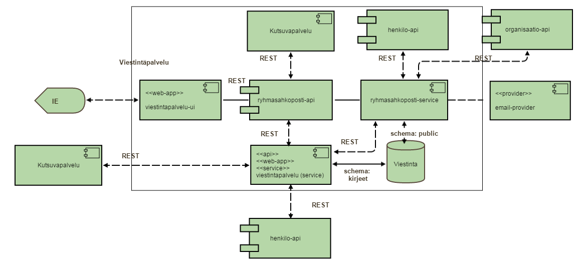

Viestintapalvelu
================

### Yleinen kuvaus
Viestintäpalvelu tarjoaa
* Sähköpostin ja ryhmäsähköpostin lähetyspalvelun esim. itserekisteröinnin vahvistussähköposti
* Raportointipalvelun lähetetyistä sähköposteista ja ryhmäsähköposteista
* Asiakirjojen muodostuspalvelun esim. jälkiohjauskirje
* Asiakirja- ja sähköpostipohjien hallintapalvelun esim. jälkiohjauskirjeen pohja

Sähköpostin ja ryhmäsähköpostin lähetyspalvelun avulla muut palvelut voivat lähettää tiedotteita eri sidosryhmille esim. oppilaitosten virkailijoille. Raportointipalvelun avulla käyttäjä voi hakea ja katsella lähetettyjen sähköpostien ja ryhmäsähköpostien tilatietoja esim. onko vastaanottaja saannut ko. sähköpostin onnistuneesti. Asiakirjojen muodostuspalvelun avulla muut palvelut voivat välittää halutut tiedot asiakirjalle ja pyytää muodostamaan asiakirjan. Asiakirja- ja sähköpostipohjien hallintapalvelussa säilytetään pohjia, joita asiakirjojen muodostuspalvelu käyttää ja tarjoaa eri versioita esim. asiakirjasta muille palveluille käytettäväksi.

Tulevaisuudessa viestintäpalvelu tarjoaa ajastus- ja ilmoituspalvelun, minkä avulla voidaan hallita ajastettuja muistutuksia esim. salasanan vaihto ja ilmoitusmuistutuksia käyttäjää kiinnostavista asioista esim. hakulomake on vastaanotettu.

### Ajaminen

mvn clean install

### Teknologiat

Alla olevassa taulukossa on kerrottu tärkeimmät palvelussa käytetyt teknologiat  

| Nimi          | Kuvaus                                                                                                      | Käyttö palvelussa            | Linkki                                                  |
|---------------|-------------------------------------------------------------------------------------------------------------|------------------------------|---------------------------------------------------------|
| AngularJS     | AngularJS on rakenteellinen sovelluskehys dynaamisten web-sovellusten rakentamiseen                         | Käyttöliittymä               | https://angularjs.org                                   |
| Apache Camel  | Apache Camel on avoin Java-sovelluskehys helpottamaan sovellusten välistä integraatiota                     | Palvelukerros                | https://camel.apache.org                                |
| Apache CXF    | Apache CXF on avoin sovelluskehys helpottamaan REST- ja SOAP-kehittämistä                                   | Palvelukerros                | http://cxf.apache.org                                   |
| Flying Saucer | Flying Saucer ottaa vastaan XML:ää tai XHTML:ää, yhdistää sen tyylisivuun ja muodostaa iTextin avulla PDF:n | Palvelukerros                | https://code.google.com/p/flying-saucer                 |
| Hibernate     | Hibernate sovelluskehyksen avulla voidaan automatisoida olioiden tallennus relaatiotietokantaan             | Tietokantakerros             | http://hibernate.org                                    |
| iText         | iText on avoin kirjasto, jonka avulla voidaan ylläpitää ja muodostaa PDF-tiedostoja                         | Palvelukerros                | http://itextpdf.com                                     |
| Jackson       | Jackson on joukko apuvälineitä JSON-tiedon käsittelyyn Javassa                                              | Palvelukerros                | https://github.com/FasterXML/jackson                    |
| Jersey        | Jersey tarjoaa REST-palveluiden ja clientien kehittämistä helpottavia välineitä                             | Palvelukerros                | https://jersey.java.net/                                |
| JPA           | Sovellusohjelmointirajapinta relaatiotietokannan käsittelyä varten Java-sovelluksissa                       | Tietokantakerros             | http://docs.oracle.com/javaee/6/tutorial/doc/bnbpz.html |
| JUnit         | Java-yksikkötestien kehittämiseen tarkoitettu kirjasto                                                      | Testaus                      | http://junit.org/                                       |
| Mockito       | Java-yksikkötestien kehittämistä helpottava kirjasto                                                        | Testaus                      | https://code.google.com/p/mockito/                      |
| PowerMock     | Java-yksikkötestien kehittämistä helpottava kirjasto                                                        | Testaus                      | https://code.google.com/p/powermock/                    |
| Spring        | Yleinen sovelluskehys Java-sovellusten kehittämiseen                                                        | Palvelu- ja tietokantakerros | http://spring.io/                                       |
| Swagger       | Kirjasto REST-rajapintojen dokumentointiin. Lisäksi käytössä Swagger-UI Javascript-kirjasto                 | Palvelukerros                | https://github.com/wordnik/swagger-core                 |

### Lisätietoja
Täydellinen tekninen dokumentaatio löytyy [tämän](https://confluence.oph.ware.fi/confluence/pages/viewpage.action?pageId=18186424) linkin takaa.
